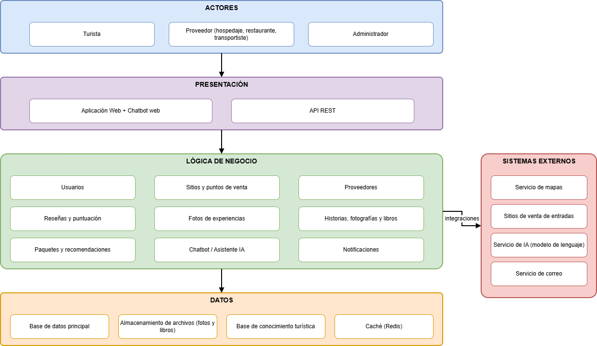

# Arquitectura inicial de LlegueYa

## Diagrama de arquitectura

```mermaid
flowchart TD

    %% =========================
    %% ACTORES
    %% =========================
    subgraph ACTORES["ACTORES"]
        Turista["Turista"]
        Proveedor["Proveedor"]
        Admin["Administrador"]
    end

    %% =========================
    %% PRESENTACIÓN
    %% =========================
    subgraph PRESENTACION["PRESENTACIÓN"]
        Web["Aplicación Web + Chatbot web"]
        API["API REST"]
    end

    %% =========================
    %% LÓGICA DE NEGOCIO
    %% =========================
    subgraph NEGOCIO["LÓGICA DE NEGOCIO"]
        Usuarios["Usuarios"]
        Sitios["Sitios y puntos de venta"]
        Proveedores["Proveedores"]
        Resenas["Reseñas y puntuación"]
        Experiencias["Fotos de experiencias"]
        Contenido["Historias, fotografías y libros"]
        Paquetes["Paquetes y recomendaciones"]
        Chatbot["Chatbot / Asistente IA"]
        Notificaciones["Notificaciones"]
    end

    %% =========================
    %% DATOS
    %% =========================
    subgraph DATOS["DATOS"]
        BD["Base de datos principal"]
        Archivos["Almacenamiento de archivos (fotos y libros)"]
        Conocimiento["Base de conocimiento turística"]
        Cache["Caché (tecnología por definir)"]
    end

    %% =========================
    %% SISTEMAS EXTERNOS
    %% =========================
    subgraph EXTERNOS["SISTEMAS EXTERNOS"]
        Mapas["Servicio de mapas"]
        Venta["Sitios de venta de entradas"]
        IA["Servicio de IA (modelo de lenguaje)"]
        Correo["Servicio de correo"]
    end

    %% =========================
    %% FLUJO PRINCIPAL
    %% =========================
    ACTORES --> PRESENTACION
    PRESENTACION --> NEGOCIO
    NEGOCIO --> DATOS

    %% Integraciones
    NEGOCIO -->|"integraciones"| EXTERNOS

    %% =========================
    %% DISTRIBUCIÓN HORIZONTAL
    %% =========================
    Turista ~~~ Proveedor
    Proveedor ~~~ Admin

    Web ~~~ API

    Usuarios ~~~ Sitios
    Sitios ~~~ Proveedores
    Resenas ~~~ Experiencias
    Experiencias ~~~ Contenido
    Paquetes ~~~ Chatbot
    Chatbot ~~~ Notificaciones

    Usuarios ~~~ Resenas
    Sitios ~~~ Experiencias
    Proveedores ~~~ Contenido
    Resenas ~~~ Paquetes
    Experiencias ~~~ Chatbot
    Contenido ~~~ Notificaciones

    BD ~~~ Archivos
    Archivos ~~~ Conocimiento
    Conocimiento ~~~ Cache

    Mapas ~~~ Venta
    Venta ~~~ IA
    IA ~~~ Correo

    %% =========================
    %% ESTILOS
    %% =========================
    style ACTORES fill:#222,stroke:#fff,stroke-width:2px,color:#fff
    style PRESENTACION fill:#222,stroke:#fff,stroke-width:2px,color:#fff
    style NEGOCIO fill:#222,stroke:#fff,stroke-width:2px,color:#fff
    style DATOS fill:#222,stroke:#fff,stroke-width:2px,color:#fff
    style EXTERNOS fill:#222,stroke:#fff,stroke-width:2px,color:#fff

    style Turista fill:#222,stroke:#fff,color:#fff
    style Proveedor fill:#222,stroke:#fff,color:#fff
    style Admin fill:#222,stroke:#fff,color:#fff

    style Web fill:#222,stroke:#fff,color:#fff
    style API fill:#222,stroke:#fff,color:#fff

    style Usuarios fill:#222,stroke:#fff,color:#fff
    style Sitios fill:#222,stroke:#fff,color:#fff
    style Proveedores fill:#222,stroke:#fff,color:#fff
    style Resenas fill:#222,stroke:#fff,color:#fff
    style Experiencias fill:#222,stroke:#fff,color:#fff
    style Contenido fill:#222,stroke:#fff,color:#fff
    style Paquetes fill:#222,stroke:#fff,color:#fff
    style Chatbot fill:#222,stroke:#fff,color:#fff
    style Notificaciones fill:#222,stroke:#fff,color:#fff

    style BD fill:#222,stroke:#fff,color:#fff
    style Archivos fill:#222,stroke:#fff,color:#fff
    style Conocimiento fill:#222,stroke:#fff,color:#fff
    style Cache fill:#222,stroke:#fff,color:#fff

    style Mapas fill:#222,stroke:#fff,color:#fff
    style Venta fill:#222,stroke:#fff,color:#fff
    style IA fill:#222,stroke:#fff,color:#fff
    style Correo fill:#222,stroke:#fff,color:#fff
```

La imagen existente se conserva en [arquitectura-inicial-drawio.png](../img/arquitectura-inicial-drawio.png). No se dispone del archivo editable original en este repositorio.

## Descripción

La arquitectura inicial se organiza en tres capas principales:

- **Presentación:** permite la interacción de los usuarios con el sistema mediante la aplicación web (que incluye el chatbot web) y la API REST.
- **Lógica de negocio:** contiene los módulos responsables de las funcionalidades del sistema: usuarios, sitios y puntos de venta, proveedores, reseñas y puntuación, fotos de experiencias, historias, fotografías y libros, paquetes y recomendaciones, chatbot y notificaciones.
- **Datos:** permite almacenar y consultar la información mediante la base de datos principal, el almacenamiento de archivos (fotos y libros), la base de conocimiento turística y la caché.

Además, la lógica de negocio se integra con sistemas externos: el **servicio de mapas** (ubicación de sitios, puntos de venta y proveedores), los **sitios de venta de entradas** (a los que solo se redirige al turista, sin cobrar), el **servicio de IA** (chatbot) y el **servicio de correo** (notificaciones).

## Responsabilidad de cada capa

| Capa | Pregunta que responde |
|---|---|
| Presentación | ¿Cómo interactúa el usuario? |
| Lógica de negocio | ¿Qué hace el sistema? |
| Datos | ¿Dónde se almacena la información? |

## Módulos de la lógica de negocio

| Módulo | Responsabilidad | Requisitos |
|---|---|---|
| Usuarios | Registro, autenticación y roles. | RF01 |
| Sitios y puntos de venta | Información de sitios, ubicación en mapa y enlaces de venta presencial o virtual. | RF02, RF03, RF04, RF19 |
| Proveedores | Registro de proveedores, carga y verificación de documentos, consulta con precios y ubicación. | RF05, RF17, RF18 |
| Reseñas y puntuación | Puntuación y comentarios de servicios; moderación. | RF06, RF07, RF21 |
| Fotos de experiencias | Subida y consulta de fotos de experiencias; moderación. | RF08, RF09, RF21 |
| Historias, fotografías y libros | Publicación y consulta de historias, fotografías de personas y libros turísticos. | RF10, RF11, RF20 |
| Paquetes y recomendaciones | Armado de paquetes con proveedores verificados y enlace de venta de la entrada. | RF13 |
| Chatbot / Asistente IA | Recomendaciones por presupuesto, mejor mes y proveedores cercanos. | RF14, RF15, RF16 |
| Notificaciones | Aviso a los usuarios cuando se publica nuevo contenido. | RF12 |

## Tecnologías sugeridas (no obligatorias)

Opciones históricas tomadas del documento inicial; no constituyen una selección de tecnologías para el monolito actual: NGINX, HAProxy o balanceador gestionado; Redis como caché; Kubernetes para orquestar y autoescalar; Cloudflare o CloudFront como CDN para contenido estático (fotos); Prometheus y Grafana para monitoreo.

## Fuera de alcance por ahora

- Venta o cobro de entradas, pasarela de pagos, QR de boletos y control de aforo.
- Chatbot por WhatsApp y Telegram.

## Imagen de la arquitectura inicial

## Estado de esta vista

Vista inicial conservada como antecedente. La [vista de componentes](componentes-arquitectonicos.md) precisa las interacciones y límites del alcance actual. Las integraciones pasan por adaptadores; el correo está por confirmar (RC09). Ver [diferencias con el PDF inicial](../fuentes/README.md).
