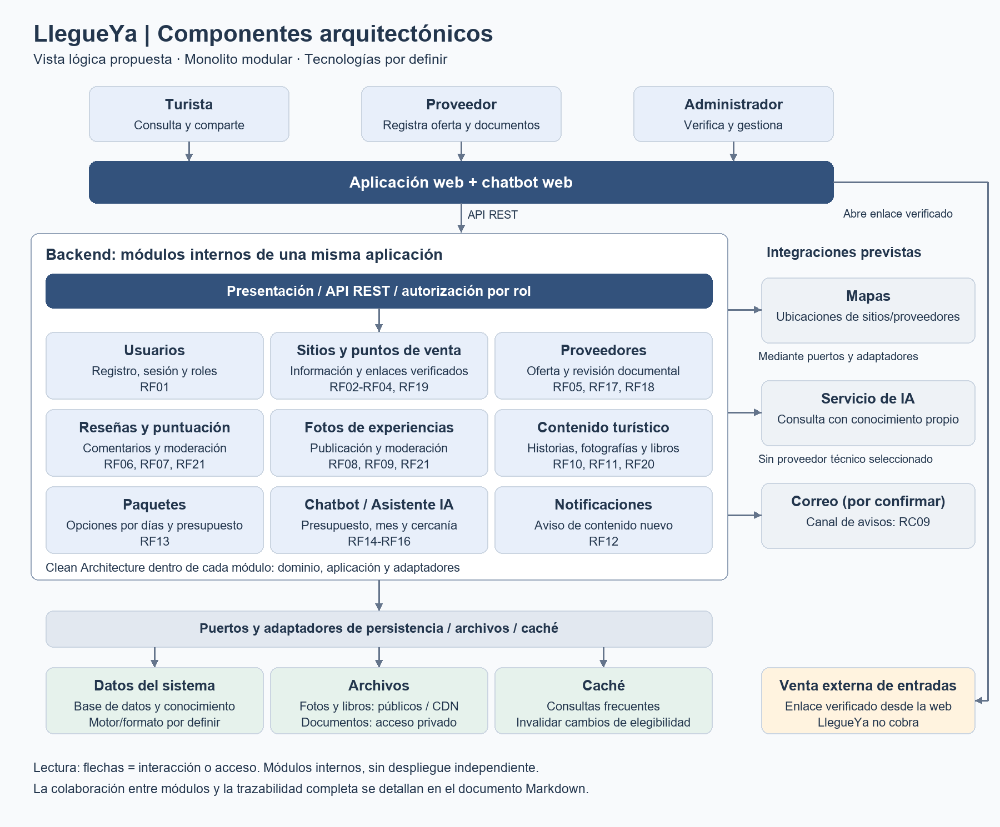
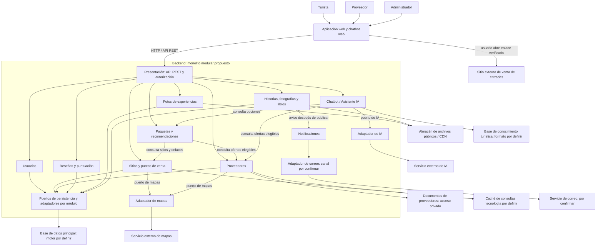

# Componentes arquitectónicos de LlegueYa

## Alcance y estado

Vista lógica de responsabilidades de la aplicación, derivada de RF01-RF21 y de ADR-001/ADR-002. Es **diseño propuesto**, no inventario de servicios implementados. Los módulos forman un monolito; no se despliegan como nueve microservicios. Los cuatro niveles C4 se documentan por separado en `modelo-c4/`, entrega del colaborador conservada sin modificaciones y fuera de la revisión de contenido de este cambio.

## Diagrama

[Fuente vectorial SVG](../img/componentes-arquitectonicos.svg).

Las flechas muestran interacción o acceso, no dependencias de importación del código. En el interior se aplica Clean Architecture: aplicación usa puertos e infraestructura implementa esos contratos. Los documentos privados de proveedores se separan del contenido público servido por CDN. El correo continúa pendiente de confirmación (RC09).

Versión textual editable:

La notificación es un caso de uso interno iniciado por la publicación. Las lecturas y escrituras de datos se hacen mediante puertos propios; las flechas a almacenes representan el flujo funcional simplificado.

## Responsabilidades y origen

| Componente lógico | Responsabilidad | Requisitos / decisión |
|---|---|---|
| Presentación/API | Recibir peticiones, invocar casos de uso y restringir operaciones por rol. | RF01; RC03; ADR-009. |
| Usuarios | Registro, inicio de sesión e identidad para operaciones protegidas. | RF01; DA11. |
| Sitios y puntos de venta | Información de acceso, ubicación y enlaces verificados registrados por el administrador. | RF02-RF04, RF19; ADR-006. |
| Proveedores | Oferta, precios/ubicación y verificación documental; solo ofertas elegibles se publican. | RF05, RF17, RF18; ADR-007. |
| Reseñas y puntuación | Publicación de comentarios/puntuaciones y moderación. | RF06, RF07, RF21; ADR-008. |
| Fotos de experiencias | Subida, consulta y moderación de fotos de usuarios registrados. | RF08, RF09, RF21; ADR-004 y ADR-008. |
| Historias, fotografías y libros | Consulta y gestión del contenido turístico publicado. | RF10, RF11, RF20; ADR-004. |
| Paquetes y recomendaciones | Combinar ofertas verificadas según días y presupuesto, con referencia a la venta externa de entradas. | RF13. |
| Chatbot / Asistente IA | Orientar por presupuesto, temporada y proveedores cercanos, apoyado en conocimiento propio. | RF14-RF16; RC08; ADR-005. |
| Notificaciones | Avisar de publicaciones nuevas; confirmar destinatarios y canal. | RF12; RC09 pendiente; ADR-005. |
| Persistencia y archivos | Guardar información por módulo, documentos privados y contenido público con políticas distintas. | ADR-002 y ADR-004; RF17. |
| Caché | Reducir consultas repetitivas e invalidar datos cuya visibilidad cambia. | ADR-003; EQ-01 y EQ-05. |

## Integraciones y límites

| Integración | Interacción prevista | No demostrado o pendiente |
|---|---|---|
| Mapas | Mostrar ubicación de sitios, puntos de venta y proveedores. | Proveedor, cálculo de rutas/cercanía y condiciones de uso por definir. |
| Venta de entradas | Mostrar punto presencial y abrir enlace virtual verificado desde el navegador. | No hay cobro, emisión QR, gestión de cupos ni integración transaccional. |
| IA | Enviar consulta y contexto turístico por un adaptador; presentar respuesta orientativa. | Modelo, recuperación del conocimiento, evaluación y costos por definir. No se presume base vectorial. |
| Correo | Aviso de nuevo contenido, si se confirma RC09. | Proveedor, consentimiento, destinatarios y reintentos por definir. |

Las cifras turísticas del PDF motivan el contexto; no prueban concurrencia ni justifican una infraestructura concreta. CDN, caché y replicación son decisiones de diseño existentes, sin despliegue acreditado.

El [diseño de módulos](../03-diseño-de-software/diseño-interno/diseño-interno-de-modulos.md) detalla Proveedores. Los [escenarios](../01-analisis-de-sistema/08-escenarios-atributos-calidad.md) establecen cómo comprobar las decisiones cuando se implemente.
