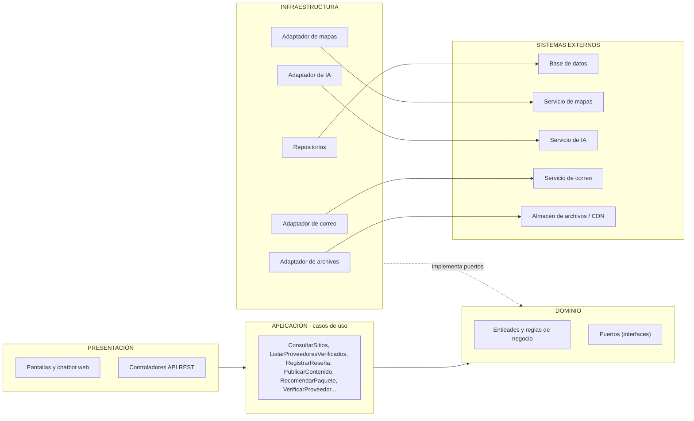

# Enfoque arquitectónico: Clean Architecture

| Elemento | Descripción aplicada a LlegueYa |
|---|---|
| Patrón / enfoque arquitectónico | Clean Architecture (Arquitectura Limpia). |
| Objetivo | Separar responsabilidades y controlar las dependencias hacia el dominio. |
| ¿Qué problema resuelve? | Evita el acoplamiento entre la interfaz, las reglas del negocio y las tecnologías externas: base de datos, servicio de mapas, servicio de IA, correo y almacén de archivos. |
| Capas definidas | Presentación, Aplicación, Dominio e Infraestructura. |
| Beneficios | Facilita el mantenimiento y las pruebas unitarias. Permite cambiar proveedores técnicos (mapas, IA, correo) sin modificar las reglas del negocio. Mejora la organización del código. |

Regla central: las dependencias del código apuntan hacia el interior. El dominio no conoce a ninguna otra capa.

## Capas y su contenido en LlegueYa

| Capa | ¿Qué contiene? | Ejemplos de LlegueYa |
|---|---|---|
| Dominio | Entidades, objetos de valor y reglas de negocio. | Usuario, Sitio, PuntoDeVenta, Proveedor, Reseña, FotoExperiencia, Historia, Fotografía, Libro, Paquete. Reglas: solo se muestran proveedores aprobados; solo se redirige a enlaces de venta verificados. |
| Aplicación | Casos de uso y puertos (interfaces). | ConsultarSitios, ObtenerEnlaceDeVenta, ListarProveedoresVerificados, RegistrarReseña, SubirFotoExperiencia, PublicarContenido, NotificarNuevoContenido, RecomendarPaquete, RecomendarMejorMes, VerificarProveedor, ModerarContenido. |
| Presentación | Pantallas y controladores que reciben la petición y responden. | Pantallas de sitios y mapa, proveedores, reseñas y fotos, historias y libros, chatbot web; controladores de la API REST. |
| Infraestructura | Implementaciones concretas de los puertos. | Repositorios sobre la base de datos, adaptador de mapas, adaptador de IA, adaptador de correo, adaptador del almacén de archivos. |

## Puertos y adaptadores

| Puerto (definido en Aplicación/Dominio) | Adaptador (Infraestructura) | Sistema externo |
|---|---|---|
| RepositorioSitios, RepositorioProveedores, RepositorioReseñas, RepositorioContenido | Repositorios de base de datos | Base de datos principal |
| ServicioMapas | Adaptador de mapas | Servicio de mapas |
| ServicioIA | Adaptador de IA | Servicio de IA (modelo de lenguaje) |
| NotificadorCorreo | Adaptador de correo | Servicio de correo |
| AlmacenArchivos | Adaptador del almacén de archivos | Almacén de archivos / CDN |

Los nombres de los puertos son una propuesta del equipo para ilustrar el enfoque, no código implementado.

## Flujo de ejemplo: consultar el enlace de venta de un sitio

1. El turista abre un sitio en la pantalla (Presentación).
2. El controlador invoca el caso de uso ObtenerEnlaceDeVenta (Aplicación).
3. El caso de uso pide el sitio al puerto RepositorioSitios y aplica la regla del dominio: solo enlaces verificados.
4. El adaptador de repositorio (Infraestructura) consulta la base de datos.
5. La pantalla muestra el punto de venta en el mapa y el botón hacia el sitio de venta. LlegueYa no cobra nada.

## Diagrama

Diagrama editable: [Draw.io](enfoque/enfoque-arquitectonico.drawio). Versión web: [HTML](enfoque/enfoque-arquitectonico.html).

## Reglas de dependencia
1. El dominio no importa nada de las demás capas.
2. Los casos de uso solo conocen entidades y puertos.
3. Los adaptadores implementan los puertos y son intercambiables.
4. Cambiar de tecnología (por ejemplo, de proveedor de mapas) afecta solo al adaptador, no al dominio.

## Decisiones relacionadas
ADR-002 (Clean Architecture), ADR-005 (puertos y adaptadores), ADR-006 (solo redirección a sitios de venta), ADR-007 (verificación de proveedores).

## Estado del enfoque

Diseño conceptual: los nombres no corresponden a código implementado. Los puertos pueden pertenecer a Aplicación o Dominio según su responsabilidad; el diseño de referencia de Proveedores los ubica en Aplicación. Infraestructura depende del contrato interior que implementa. El correo sigue por confirmar (RC09).
