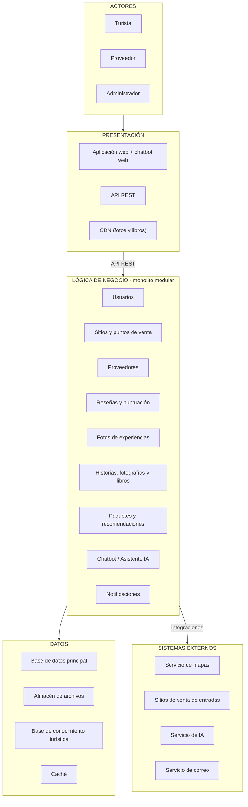

# Estilo arquitectónico

## Estilo seleccionado

**Monolito modular organizado en capas** (Presentación, Lógica de negocio y Datos), con un frontend web que se comunica con el backend mediante una API REST.

| Elemento | Descripción aplicada a LlegueYa |
|---|---|
| Estilo | Monolito modular en capas, cliente-servidor sobre API REST. |
| Unidad de despliegue | Una sola aplicación desplegable. La organización lógica es por módulos; el despliegue es único. |
| Módulos | Usuarios, Sitios y puntos de venta, Proveedores, Reseñas y puntuación, Fotos de experiencias, Historias fotografías y libros, Paquetes y recomendaciones, Chatbot / Asistente IA y Notificaciones. |
| Escalamiento | Horizontal: se replica la aplicación detrás de un balanceador de carga para las fechas de festividad. Los archivos estáticos (fotos y libros) se sirven por CDN. |
| Integraciones | Servicio de mapas, sitios de venta de entradas (solo redirección), servicio de IA y servicio de correo. |

## Diagrama

Diagrama editable: [Draw.io](estilo-arquitectonico.drawio). Versión web: [HTML](estilo-arquitectonico.html).

## Reglas del estilo

1. El flujo funcional va de presentación a casos de uso y datos mediante puertos. Las dependencias del código siguen Clean Architecture: el dominio no depende de infraestructura, y los adaptadores implementan contratos internos.
2. Un módulo no accede a las tablas de otro módulo: se comunica con su servicio.
3. Todo se ejecuta en una única aplicación desplegable (ADR-001).
4. Frontend y backend se comunican solo por API REST (ADR-009).

## Decisiones relacionadas
ADR-001 (monolito modular), ADR-003 (caché), ADR-004 (archivos y CDN), ADR-009 (API REST). Ver [ADR](../01-analisis-de-sistema/07-decisiones-arquitectonicas.md).

## Estado y relación con el enfoque

El monolito modular es la organización y unidad de despliegue **propuesta**; Clean Architecture es la organización interna de dependencias. La replicación, balanceo, caché y CDN no están desplegados ni demuestran las metas de calidad. El frontend es la interfaz cliente; no se ha definido si se publica junto al backend o como recurso separado. El correo sigue por confirmar (RC09).
