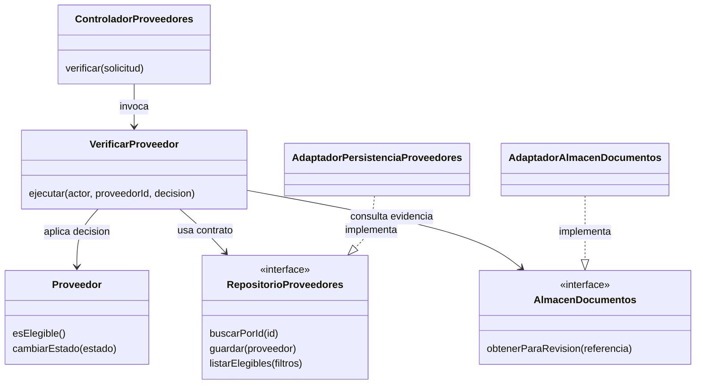

# Diseño interno de módulos de LlegueYa

## Propósito y estado

Detallar responsabilidades, contratos y colaboración dentro del monolito modular definido en ADR-001, aplicando Clean Architecture (ADR-002). El módulo de referencia es **Proveedores**, porque sus reglas afectan consultas, paquetes y chatbot (RF05, RF17, RF18; DA04).

**Este documento es una propuesta de diseño, no una descripción de código implementado.** Los nombres de clases, métodos y carpetas son conceptuales. No se ha elegido lenguaje, framework, motor de base de datos ni proveedores de mapas o IA. La sección `04-modelo-c4` corresponde al colaborador; aquí se documenta diseño interno, sin elaborar sus entregables C4.

## 1. Módulos y responsabilidad

Se conservan los nueve módulos de la [arquitectura inicial](../../02-arquitectura-software/arquitectura-inicial.md).

| Módulo | Responsabilidad y operaciones conceptuales | Requisitos |
|---|---|---|
| Usuarios | RegistrarUsuario, IniciarSesion y verificar permisos según rol. | RF01 |
| Sitios y puntos de venta | ConsultarSitios, ObtenerEnlaceDeVentaVerificado y GestionarSitio. Conserva ubicación y puntos/enlaces de venta. | RF02-RF04, RF19 |
| Proveedores | RegistrarOferta, CargarDocumentos, VerificarProveedor y ListarProveedoresVerificados. | RF05, RF17, RF18 |
| Reseñas y puntuación | RegistrarReseña, ConsultarPuntuacion y ModerarReseña. | RF06, RF07, RF21 |
| Fotos de experiencias | SubirFotoExperiencia, ConsultarFotos y ModerarFoto. | RF08, RF09, RF21 |
| Historias, fotografías y libros | ConsultarContenido y GestionarContenidoTuristico; publicar, actualizar y retirar. | RF10, RF11, RF20 |
| Paquetes y recomendaciones | ArmarPaquete con proveedores elegibles, días y presupuesto; incluir referencia de venta externa. | RF13 |
| Chatbot / Asistente IA | RecomendarPorPresupuesto, RecomendarMes y SugerirProveedoresCercanos con conocimiento propio. | RF14-RF16 |
| Notificaciones | NotificarNuevoContenido a los usuarios destinatarios. Canal por correo pendiente de confirmación (RC09). | RF12 |

Los paquetes son propuestas de viaje; no agregan reserva, compra, cobro ni emisión de boletos.

## 2. Organización interna propuesta

```text
modulos/
└── proveedores/
    ├── dominio/
    │   ├── Proveedor
    │   ├── DocumentoProveedor
    │   └── EstadoVerificacion
    ├── aplicacion/
    │   ├── RegistrarOferta
    │   ├── CargarDocumentos
    │   ├── VerificarProveedor
    │   ├── ListarProveedoresVerificados
    │   └── puertos/
    │       ├── RepositorioProveedores
    │       └── AlmacenDocumentos
    ├── infraestructura/
    │   ├── AdaptadorPersistenciaProveedores
    │   └── AdaptadorAlmacenDocumentos
    ├── presentacion/
    │   └── ControladorProveedores
    ├── composicion/
    │   └── ConfiguracionProveedores
    └── api-publica/
        └── ConsultaProveedoresVerificados
```

Es un esquema para la futura implementación; esos archivos no existen como aplicación ejecutable. No se asignan extensiones de un lenguaje aún no seleccionado. Los otros módulos seguirían la misma separación cuando necesiten esas responsabilidades.

| Capa | Contenido | Dependencias permitidas |
|---|---|---|
| Dominio | Entidades y reglas de elegibilidad/verificación. | Su propio dominio; sin HTTP, SQL, SDK ni otras capas. |
| Aplicación | Casos de uso y contratos necesarios para persistencia y archivos. | Dominio y puertos de aplicación; contratos públicos de otros módulos cuando corresponda. |
| Infraestructura | Implementaciones de repositorios y adaptadores. | Contratos que implementa, dominio y bibliotecas técnicas. |
| Presentación | Traducción entre HTTP y entradas/resultados de casos de uso. | Aplicación; sin acceso directo a la base de datos. |
| Composición | Construir y conectar implementaciones concretas. | Las capas que conecta. No contiene reglas del negocio. |

Los puertos se ubican aquí en Aplicación, tal como permite el enfoque ya documentado. La regla importante es la dirección de dependencia: los casos de uso no conocen adaptadores concretos. Las llamadas en ejecución al adaptador se realizan a través del puerto.

## 3. Entidades y contratos del módulo Proveedores

| Elemento propuesto | Datos u operaciones mínimas | Responsabilidad / origen |
|---|---|---|
| Proveedor | Identificador, referencia al usuario proveedor, tipo de servicio, oferta, precio informado, ubicación, estado y referencias a documentos. `esElegible()` y `cambiarEstado(estado)`. | Encapsular si la oferta puede aparecer en LlegueYa. RF05, RF17, RF18; ADR-007. |
| DocumentoProveedor | Tipo, referencia privada al archivo y datos necesarios para revisar vigencia. | Evidencia para revisión administrativa. RC07. Los documentos exactos y sus reglas de vigencia están pendientes. |
| EstadoVerificacion | Aprobado, rechazado y suspendido ya definidos en ADR-007; **pendiente de revisión** propuesto para una oferta recién enviada. | Evitar publicar una oferta antes de verificarla. El estado inicial es una precisión de diseño por validar. |
| RepositorioProveedores | `buscarPorId(id)`, `guardar(proveedor)`, `listarElegibles(filtros)`. | Persistencia sin revelar SQL, ORM ni motor al caso de uso. |
| AlmacenDocumentos | `guardar(archivo)` y `obtenerParaRevision(referencia)`. | Almacenar documentos y recuperarlos solo para operaciones autorizadas. No equivale al CDN público de fotos y libros. |
| VerificarProveedor | `ejecutar(actor, proveedorId, decision)`. | Comprobar permiso de administrador, recuperar datos, aplicar la decisión y persistir. RF18. |
| ConsultaProveedoresVerificados | `listar(filtros)` y `obtenerElegible(id)`. | Ofrecer datos públicos de ofertas elegibles a Paquetes y Chatbot, sin exponer expedientes. RF05, RF13, RF16. |

**Regla de elegibilidad:** aprobado por el administrador y documentación vigente según criterios por definir. Rechazado, suspendido o pendiente no se ofrece en consultas, paquetes ni recomendaciones. Verificación documental no significa certificación automática de seguridad física del servicio.

No se fija escala de puntuación, plazo de vigencia documental, esquema SQL ni formato de identificadores: las fuentes no los definen.

## 4. Colaboración interna



Diagrama conceptual de diseño interno. No acredita implementación ni reemplaza el trabajo de la sección C4 del colaborador.

## 5. Flujo: verificar un proveedor

| Paso | Colaboración | Resultado esperado |
|---|---|---|
| 1 | Administrador → presentación/API | Solicita aprobar, rechazar o suspender un proveedor. |
| 2 | Controlador → VerificarProveedor | Entrega actor autenticado y datos de la solicitud; la identidad no se confía a un campo enviado por el usuario. |
| 3 | Caso de uso → autorización | Comprueba permiso administrativo antes de consultar documentos o modificar datos. |
| 4 | Caso de uso → RepositorioProveedores / AlmacenDocumentos | Recupera oferta y evidencia privada para la revisión. |
| 5 | Administrador / caso de uso → Proveedor | Registra decisión; aprobar requiere la revisión documental correspondiente. No se inventa una validación automática ante entidades públicas. |
| 6 | Caso de uso → RepositorioProveedores | Guarda el estado. Si falla la persistencia, no informa éxito. |
| 7 | Infraestructura de caché | Invalida datos afectados al cambiar elegibilidad (ADR-003). La estrategia concreta se debe definir antes de implementar. |
| 8 | Controlador → administrador | Devuelve resultado controlado. Las consultas públicas usan únicamente ofertas elegibles. |

Alternativas: usuario sin permiso → denegar; proveedor inexistente → informar ausencia; documentación insuficiente → no aprobar; fallo de almacenamiento → informar fallo sin afirmar verificación completada. Los códigos HTTP concretos se definirán con el contrato de API.

## 6. Comunicación entre módulos

| Consumidor | Contrato que necesita | Límite |
|---|---|---|
| Paquetes | ConsultaProveedoresVerificados; consulta de Sitios y puntos de venta. | No leer tablas ajenas ni incluir proveedores inelegibles. |
| Chatbot | Consultas públicas de proveedores/paquetes y conocimiento turístico. | La respuesta del modelo no habilita una oferta suspendida ni crea precios ausentes. |
| Reseñas / Fotos | Identidad del usuario y referencias públicas del servicio o experiencia. | No acceder a credenciales ni documentos del proveedor. La relación exacta de una foto con sitio/servicio está pendiente. |
| Contenido → Notificaciones | Operación de aviso después de confirmar la publicación. | No notificar antes de guardar el contenido. Canal y política de destinatarios pendientes. |

Estas colaboraciones son llamadas internas del monolito a contratos públicos, no nuevos servicios desplegables. No se presupone broker de mensajes.

## 7. Criterios de revisión al implementar

- Los nueve módulos tienen trazabilidad a RF01-RF21; no se agregan pagos, QR ni aforo.
- El dominio no importa infraestructura ni bibliotecas de servicios externos.
- Cambiar persistencia o mapas no modifica reglas de verificación.
- Las consultas públicas, Paquetes y Chatbot excluyen ofertas no elegibles.
- Las operaciones administrativas comprueban permisos y mantienen privados los documentos.

Ver [patrones](patrones-de-diseño.md), [principios](principios-de-diseño.md), [escenarios EQ-04, EQ-05 y EQ-07](../../01-analisis-de-sistema/08-escenarios-atributos-calidad.md) y [fuentes y diferencias de alcance](../../fuentes/README.md).
